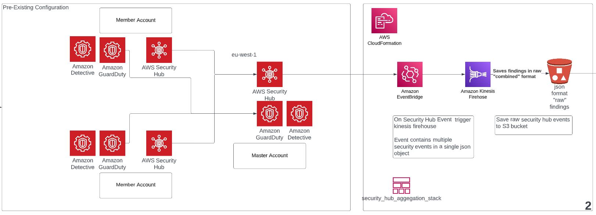
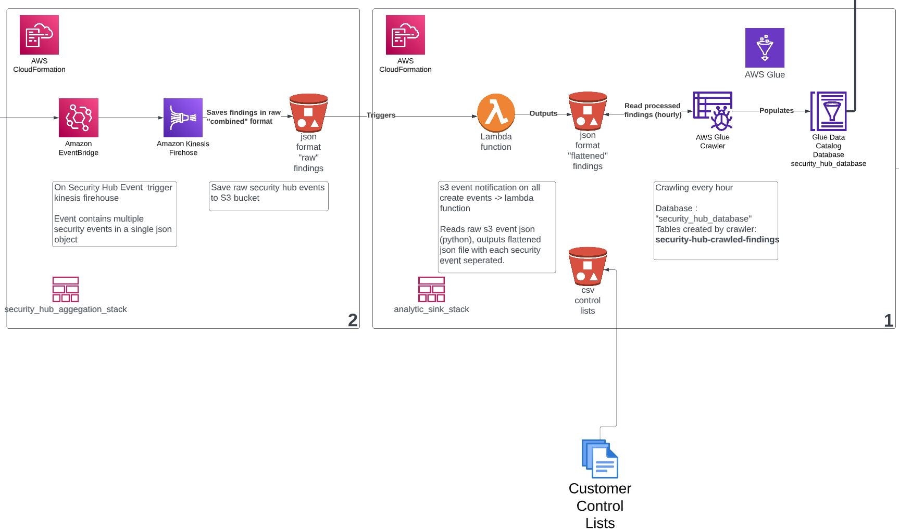
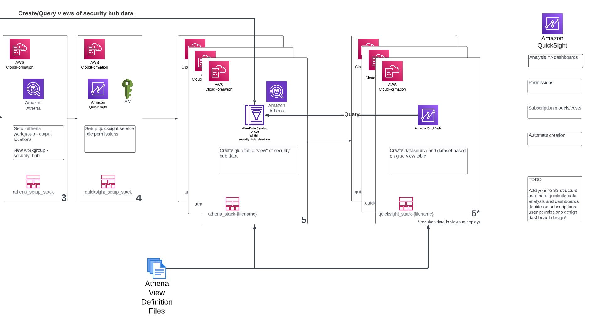
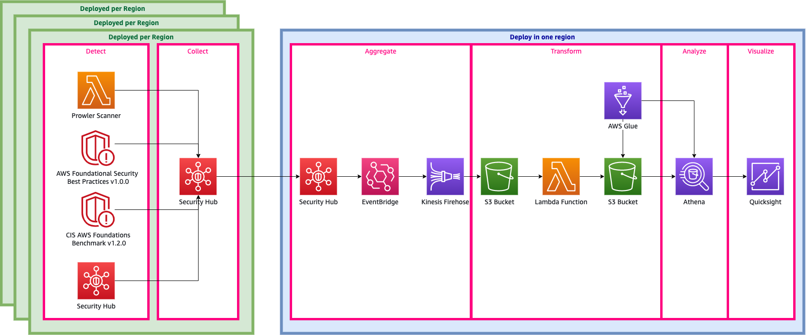

## CLONE OF AWS Security Hub Analytic Pipeline (aws-samples/aws-security-hub-analytic-pipeline)

Clone of aws-samples/aws-security-hub-analytic-pipeline. 

Adjusted to NOT deploy AWS security hub aggregation and enablement, assumes this is already deployed.

Changed the code so everything runs on eu-west-1, so look for that in various places!

Added:
- stack to create athena workspace
- stack to create glue view tables / athena views based on json files
- python script in [stacks/views](stacks/views/README.md) extracts a manually created view into json (see readme)
- stack to create quicksight datasource
- stack to create quicksight dataset based on json files
- added guardduty to events ingested, adjusted transformation lambda to allow for this
- re-structed S3 to organise by product, then account, then date (note year isnt used in the key so that might cause an issue later!)
- forced crawler to use a single path and created 2nd crawler for guardduty
- added csv file input to filter security hub for end customers list of controls

NOTE: stack for quicksight fails if the crawler in the previous stacks has not created any data, so this probably should be in it's own cdk application!

First run do this:

- use cdk list to see what stacks ae being built
- exclude all the QuickSight stacks from the first build, once there is data in the views created in athena re-run --all

### example first run

```bash
$ cdk list
AnalyticSink
Aggregation
AthenaSecurityHubSetup
AthenaSecurityHub-security-hub-detail-by-account
AthenaSecurityHub-security-hub-detail-flt-cust
AthenaSecurityHub-security-hub-detail-match-cust
QuickSightSetup
QuickSight-security-hub-detail-by-account
QuickSight-security-hub-detail-flt-cust
QuickSight-security-hub-detail-match-cust
```

```bash
$ cdk deploy AnalyticSink Aggregation AthenaSecurityHub*
```


## stack topology








### Orginal AWS readme...

[AWS Security Hub](https://aws.amazon.com/security-hub/) is a service that gives you aggregated visibility into your security and compliance posture across multiple AWS accounts. By exporting findings to Athena, you can enrich the data up with additional sources such as your configuration management database (CMDB) or IT service management database.  Additionally, you can build analytic dimenions to find trends and patterns.  This code is part of an upcoming blog post (link TBA) on visualizing Security Hub Findings to senior leaders and decision-makers.

This repository contains a CDK stack that builds the following infrastructure



Essentially there are two CDK Stacks (in one CDK Application):
- A stack deployed per region containing Security Hub and handles the necessary infrastructure to stream findings to S3
- A stack deployed once containing all the infrastructure to transform raw findings and expose it with Athena.

Additionally, included in the CDK application is Serverless Prowler Scanner designed to quickly provide real-data to help you walk through the Athena and QuickSight pieces, 
by providing you with actual actionable data.

## Building the stack

Create a virtual environment

```bash
$ python3 -m venv .venv
$ source .venv/bin/activate
```

Install CDK dependencies

```bash
$ pip install -r requirements.txt
```

## Deploy the stack

```bash
$ cdk deploy
```

## Tested Use Case
- AWS native security services -- GuardDuty, Access Analyzer, Inspector
- Security Hub standards -- CIS Benchmark, PCI/DSS, AWS Security Best Practices
- Third Party Integrations -- Prowler

## Security

See [CONTRIBUTING](CONTRIBUTING.md#security-issue-notifications) for more information.

## License

This library is licensed under the MIT-0 License. See the LICENSE file.

